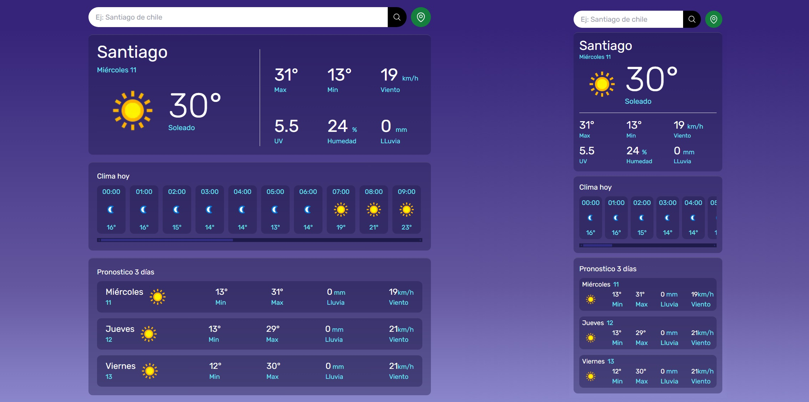

# App clima React Tailwind CSS

Como el título indica, esta es una aplicación para ver el clima, creada con React y Tailwind CSS. Inicialmente pensada como un proyecto pequeño y exclusivamente front-end, pero se tuvo que utilizar PHP únicamente para ocultar las claves de las API.

Este no es un proyecto completamente nuevo, ya que lo había creado anteriormente utilizando solo HTML y JS, pero decidí rehacerlo desde cero para practicar más React, ya que es una tecnología que estoy aprendiendo recientemente. Cabe mencionar que no soy un experto en React, pero estoy trabajando en mejorar mis habilidades.

Además, se agregaron algunas funciones nuevas, como la opción de seleccionar el resultado más relevante al buscar una ubicación y un botón para obtener el pronóstico de la ubicación del usuario mediante la API de geolocalización del navegador. 

# APIs utilzadas:
Utilicé varias APIs para diferentes funcionalidades. A continuación, se presenta un listado con las APIs y su propósito:

- [IPinfo](https://ipinfo.io/): Usada para obtener la ubicación inicial del usuario. Aunque lo normal es que devuelva la localización del proveedor de internet, es útil para mostrar una ubicación por defecto (generalmente una ciudad de país del usuario).

- [WeatherAPI](https://www.weatherapi.com/): Usada para obtener el pronóstico del clima. Esta API requiere la longitud y latitud para obtener los detalles. Se utiliza en conjunto con IPinfo y Nominatim (OpenStreetMap). Al usar una cuenta gratuita, solo está disponible el pronóstico para 3 días.

- [Nominatim (OpenStreetMap)](https://nominatim.org/): Usada para buscar una ubicación por texto. Esta API devuelve una lista con los resultados más relevantes.